# Supply chain & data auditing

This repository contains an Ethereum DApp that demonstrates a Supply Chain flow between a Seller and Buyer. The user story is similar to any commonly used supply chain process. A Seller can add items to the inventory system stored in the blockchain. A Buyer can purchase such items from the inventory system. Additionally a Seller can mark an item as Shipped, and similarly a Buyer can mark an item as Received.

The DApp User Interface when running should look like...

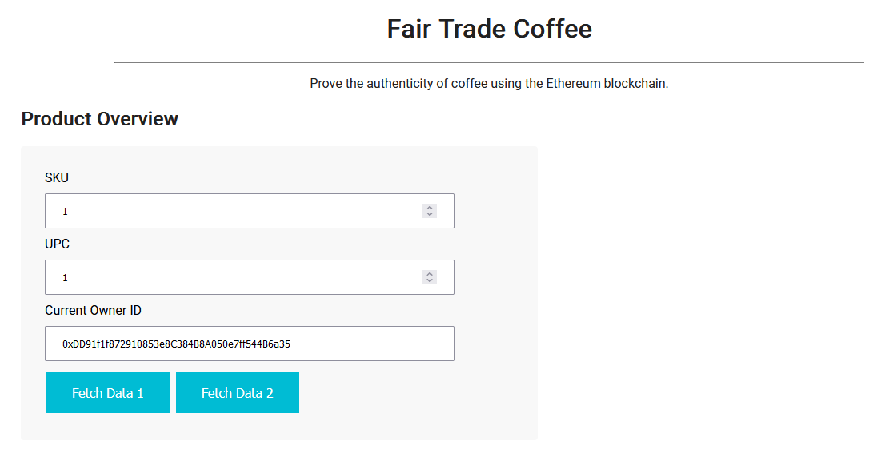

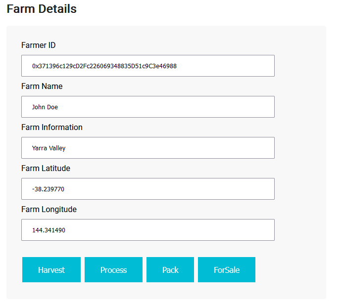

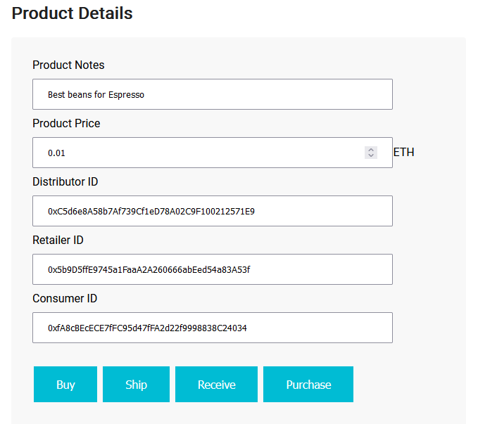

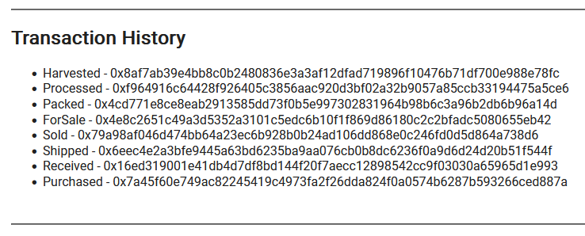

## UML Diagrams

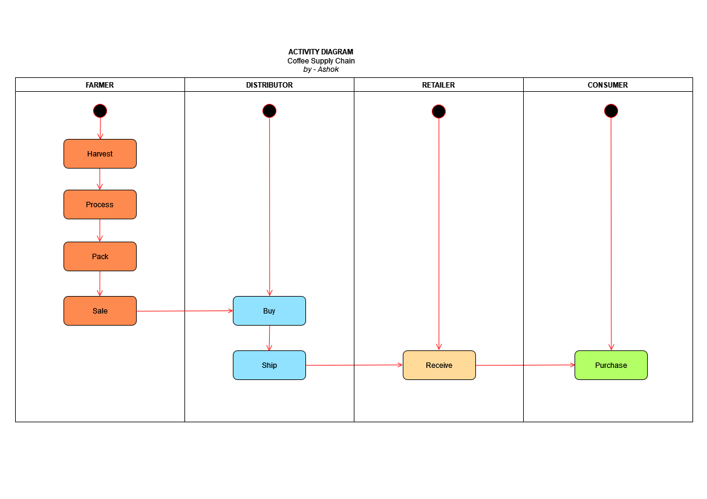

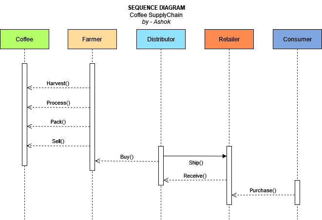

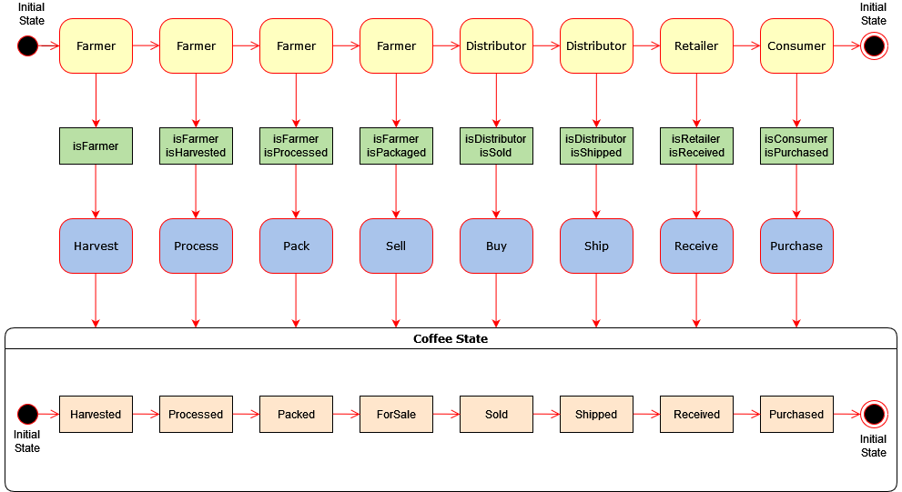

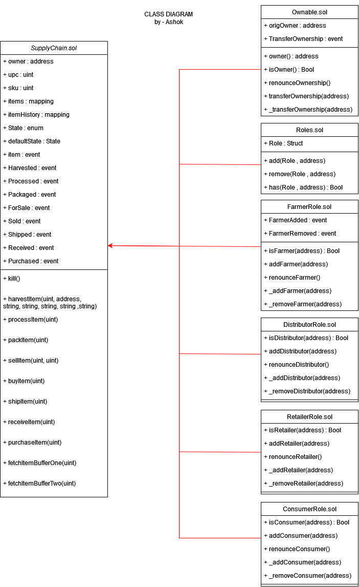

## Getting Started

These instructions will get you a copy of the project up and running on your local machine for development and testing purposes. See deployment for notes on how to deploy the project on a live system.

### Prerequisites

Please make sure you've already installed ganache-cli, Truffle and enabled MetaMask extension in your browser.

```
Give examples (to be clarified)
```

### Installing

> The starter code is written for **Solidity v0.8.0**. At the time of writing, the current Truffle v5 comes with Solidity v0.5 that requires function *mutability* and *visibility* to be specified (please refer to Solidity [documentation](https://docs.soliditylang.org/en/v0.5.0/050-breaking-changes.html) for more details). To use this starter code, please run `npm i -g truffle` to install Truffle with Solidity v0.8.0. 

A step by step series of examples that tell you have to get a development env running

Clone this repository:

```
git clone https://github.com/ashoktut/supplyChain-Dapp.git
```

Change directory to ```project-6``` folder and install all requisite npm packages (as listed in ```package.json```):

```
cd project-6
npm install
```

Launch Ganache:

```
ganache-cli -m "test fail rug dumb soldier matrix multiply eager brown garage lens sense"
```

Your terminal should look something like this:

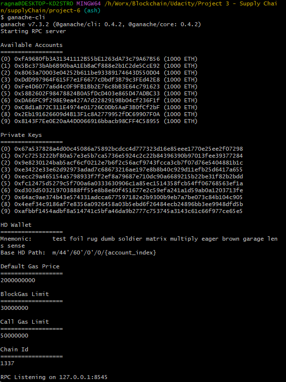

In a separate terminal window, Compile smart contracts:

```
truffle compile
```

Your terminal should look something like this:

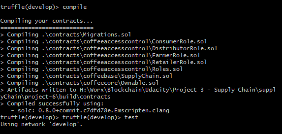

This will create the smart contract artifacts in folder ```build\contracts```.

Migrate smart contracts to the locally running blockchain, ganache-cli:

```
truffle migrate
```

Your terminal should look something like this:

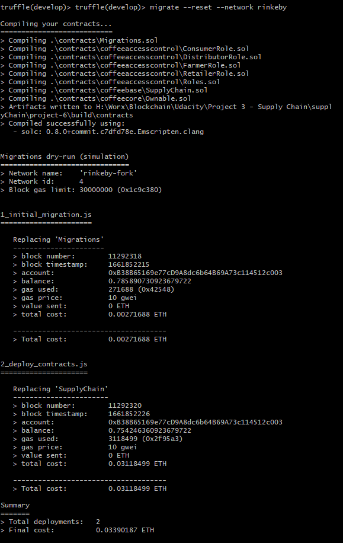

Test smart contracts:

```
truffle test
```

All 10 tests should pass.

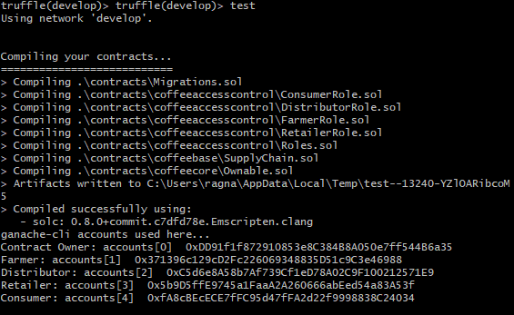

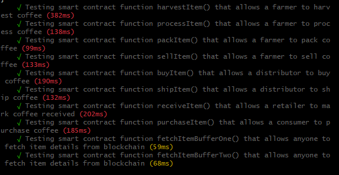

In a separate terminal window, launch the DApp:

```
npm run dev
```

## Built With

* [Ethereum](https://www.ethereum.org/) - Ethereum is a decentralized platform that runs smart contracts
* [IPFS](https://ipfs.io/) - IPFS is the Distributed Web | A peer-to-peer hypermedia protocol
to make the web faster, safer, and more open.
* [Truffle Framework](http://truffleframework.com/) - Truffle is the most popular development framework for Ethereum with a mission to make your life a whole lot easier.

## Versions Used

Truffle v5.5.28 (core: 5.5.28)
Ganache v7.4.0
Solidity - 0.8.0 (solc-js)
Node v14.17.0
Web3.js v1.7.4

## Authors

Ashok
